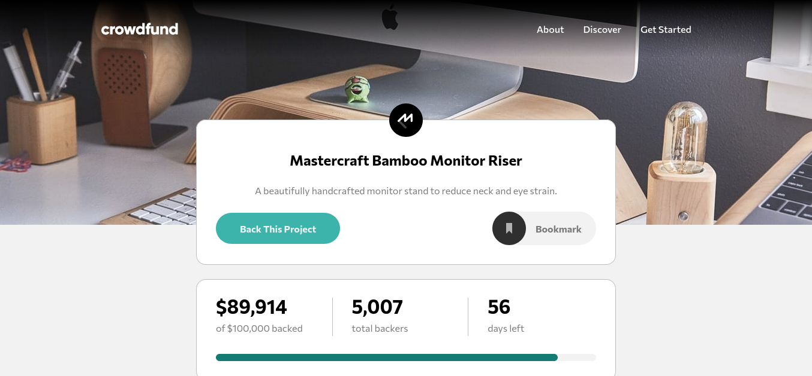

# Frontend Mentor - Crowdfunding Product Page

This is my implementation of Frontend Mentor's ["Crowdfunding Product Page" challenge](https://www.frontendmentor.io/challenges/crowdfunding-product-page-7uvcZe7ZR). Frontend Mentor challenges help you improve your coding skills by building realistic projects.

## Table of contents

- [Overview](#overview)
  - [The challenge](#the-challenge)
  - [Screenshot](#screenshot)
  - [Links](#links)
- [My process](#my-process)
  - [Built with](#built-with)
  - [What I learned](#what-i-learned)
- [Author](#author)
- [Acknowledgments](#acknowledgments)

**Note: Delete this note and update the table of contents based on what sections you keep.**

## Overview

### The challenge

Users should be able to:

- View the optimal layout depending on their device's screen size
- See hover states for interactive elements
- Make a selection of which pledge to make
- See an updated progress bar and total money raised based on their pledge total after confirming a pledge
- See the number of total backers increment by one after confirming a pledge
- Toggle whether or not the product is bookmarked

### Screenshot



### Links

- Solution URL: https://github.com/dgdev1024/2021-fm-crowdfunding-product-page
- Live Site URL: https://2021-fm-crowdfunding-product-page.vercel.app/

## My process

### Built with

- [React](https://reactjs.org/) - JS library
- [SASS/SCSS](https://sass-lang.com/) - CSS preprocessor
- [Parcel](https://parceljs.org/) - Web application bundler ([version2](https://v2.parceljs.org/))

### What I learned

1. My first implementation of this project started to get pretty messy once I started implementing the modal boxes. I rectified that by outsourcing information about the product (name, money backed, backer perks, etc.) to a JSON file, the data from which is retrieved using React's Context API. The Product Context, shown in the `contexts/product.jsx` file below, is also responsible for updating backer and perk information shown on the page, whenever a pledge is made.

```Javascript
/**
 * @file contexts/product.jsx
 * @brief Context containing product properties and backer perks.
 */

import React, { useState, useContext } from "react";
import Product from "../lib/product.json";

const ProductContext = React.createContext();
const ProductProvider = ({ children }) => {
  const [moneyBacked, setMoneyBacked] = useState(Product.moneyBacked);
  const [backerCount, setBackerCount] = useState(Product.backerCount);
  const [perks, setPerks] = useState(Product.perks);
  const [selectedPerk, setSelectedPerk] = useState(-1);

  const makePledge = (id, amount) => {
    const slicedPerks = perks.slice();
    const hasRemaining = typeof slicedPerks[id].remaining === "number";
    const hasMinPledge = typeof slicedPerks[id].minimumPledge === "number";

    if (hasRemaining && slicedPerks[id].remaining <= 0) {
      return false;
    }

    if (hasMinPledge && slicedPerks[id].minimumPledge > amount) {
      return false;
    }

    if (hasRemaining) {
      slicedPerks[id].remaining -= 1;
    }

    setPerks(slicedPerks);
    setBackerCount((count) => count + 1);
    setMoneyBacked((backed) => backed + amount);
    return true;
  };

  return (
    <ProductContext.Provider
      value={{
        name: Product.name,
        description: Product.description,
        about: Product.about,
        perks,
        moneyBacked,
        moneyNeeded: Product.moneyNeeded,
        daysLeft: Product.daysLeft,
        backerCount,
        makePledge,
        selectedPerk,
        setSelectedPerk,
      }}
    >
      {children}
    </ProductContext.Provider>
  );
};

export default ProductProvider;
export const useProductContext = () => useContext(ProductContext);
```

2. The inner workings of the modal box make great use of React's `useEffect` hook to disable and enable scrolling when the box appears and disappears, respectively, and for dynamically setting its CSS grid `align-items` property based on the modal box's height, as shown in the code below:

```Javascript
// src/components/app/index.jsx

// ...
const [activeModal, setActiveModal] = useState("");

/*
  Effect hook to disable scrolling the main page if a modal window is on screen.

  Source: https://stackoverflow.com/a/66985940/2868302
  Derived from code by Martin Grönlund (https://stackoverflow.com/users/1780962/martin-gr%c3%b6nlund)
  License: CC BY-SA 4.0 (https://creativecommons.org/licenses/by-sa/4.0/)
*/
useEffect(() => {
  document.body.style.overflowY = activeModal === "" ? "scroll" : "hidden";
  return () => {
    document.body.style.overflowY = "scroll";
  };
}, [activeModal]);
// ...
```

```Javascript
// src/components/modal/index.jsx

// ...
const modalBoxRef = useRef(null);
const modalBgRef = useRef(null);

useEffect(() => {
  const { current: modalBg } = modalBgRef;
  const { current: modalBox } = modalBoxRef;
  const { height: modalBgHeight } = modalBg.getBoundingClientRect();
  const { height: modalBoxHeight } = modalBox.getBoundingClientRect();

  if (modalBoxHeight > modalBgHeight) {
    modalBg.style.alignItems = "start";
  } else {
    modalBg.style.alignItems = "center";
  }
}, []);
// ...
```

## Author

- Website - [Dennis Griffin](https://dgdev1024.com)
- Frontend Mentor - [@dgdev1024](https://www.frontendmentor.io/profile/dgdev1024)
- Twitter - [@dgdev1024](https://www.twitter.com/dgdev1024)

## Acknowledgments

The `useEffect` hook in `src/components/app/index.jsx` is derived from source code on Stack Overflow (https://stackoverflow.com/a/66985940/2868302), posted by Martin Grönlund (https://stackoverflow.com/users/1780962/martin-gr%c3%b6nlund), licensed by the Creative Commons CC BY-SA 4.0 license (https://creativecommons.org/licenses/by-sa/4.0/).
